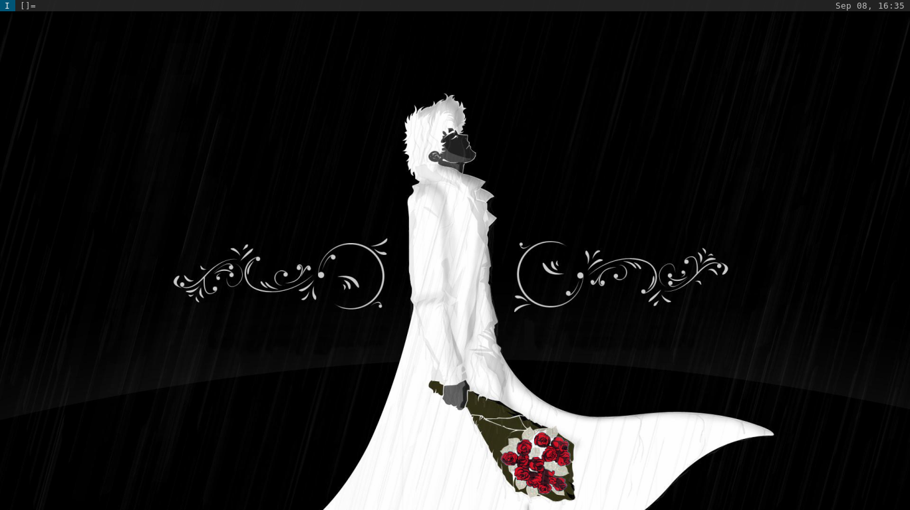

#### Tweaks by stpettersens
Set narrower borders and spacing around windows.

I also use a [forked version of swindlemccoop's dwmblocks build](https://github.com/stpettersens/dwmblocks) to just display the date and time.

I made the following changes to swindlemccoop's build of dwm:

* Modkey + b launches browser (librewolf, or if patched brave with brave.diff) rather than togglebar
* Modkey + Return launches alacritty (replaced st as terminal)
* Modkey + x launches a dmenu prompt to poweroff or reboot system (or cancel)
* Modkey + v now does togglebar rather than Modkey + b
* Modkey + s takes a fullscreen screenshot with flameshot
* Modkey + w changes desktop wallpaper using feh --fill-bg --randomize ~/Pictures/wallpaper


  
Remember to install feh, librewolf, alacritty and picom or take it out of .xinitrc and .xsession.

FreeBSD:
`(doas) pkg install feh librewolf alacritty picom`

OpenBSD:
`(doas) pkg_add feh librewolf alacritty picom`

Ubuntu:
`(sudo) apt install feh alacritty picom`

On Ubuntu, you can use the [AppImage version
of LibreWolf](https://librewolf.net/installation/linux). 

Set the path to your wallpapers directory in set_wallpaper.
Remember to copy .xinitrc and .xsession to your home folder (~).
  
To use brave browser rather than librewolf, run the 
following command before building with gmake/make:
> `patch config.h < brave.diff`

# DWM
DWM is my favorite window manager by far due to its simplicity, portability, and low resource usage. However, it requires a decent amount of tweaking if you want to be able to use it for standard tasks. That's what I've aimed to do here, creating a user-friendly environment and memorable keybinds.

## Compiling
### Dependencies
X11, Xinerama, xcb, freetype
### Instructions
Run `./configure` to properly set up `config.mk`.
#### Linux
`make && sudo make install`
#### FreeBSD, OpenBSD
`gmake && doas gmake install`

## Patches applied
```
dwmblocks (statuscmd)
dwmblocks (SIGUSR1)
bar layout symbol -- show window layout in status bar
bar status -- show status in bar
bar tag symbols -- show tag symbols in bar
bar window title -- show window title in bar
bar alpha -- semi-transparency on bar
bar hide vacant tags -- hide tags with no windows
attach aside -- add new windows to stack instead of master
cool autostart -- execute commands on start and have processes owned by dwm
dwmc -- use dwmc program to execute dwm commands (for scriptability)
fullscreen -- applies monocle layout on active window and hides bar
moveresize -- resize dwm windows with keybinds
movestack -- allows to move windows in stack and to become master
no transparent borders -- make window borders always solid
scratchpads -- allow for scratchpad terminals
swallow -- hide terminal window when it spawns a window and freezes itself (not working on OpenBSD)
togglefullscreen -- use a keybind to make a window fullscreen or not
vanitygaps -- add gaps between all windows
```

## Software Made to Work With This
- [DWMBlocks](https://github.com/swindlesmccoop/dwmblocks)
- [DMenu](https://github.com/swindlesmccoop/dmenu)
- [ST](https://github.com/swindlesmccoop/st)

## Keybinds
All keybinds can be found by running `man dwm`, but here are the important ones:
- `Super + Enter` - Spawn terminal (st)
- `Super + Shift + Enter`, `F12` - Toggle scratchpad terminal
- `Super + h/l` - Shrink/enlarge master window
- `Super + d` - dmenu\_run (program launcher)
- `Super + q` - Kill window
- `Super + b` - Toggle status bar
- `Super + f` - Toggle fullscreen
- `Super + m` - Set window as master
- `Super + o/O` - Increase/decrease number of masters
- `Super + j/k` - Move focus down/up
- `Super + J/K` - Move window in stack down/up
- `Super + E`, `Super + Q` - Kill DWM
- `Super + Space` - Set all windows to Floating mode
- `Super + [Arrow]` - Move window in direction of arrow pressed
- `Super + Shift + [Arrow]` - Expand/shrink window in direction of arrow pressed
